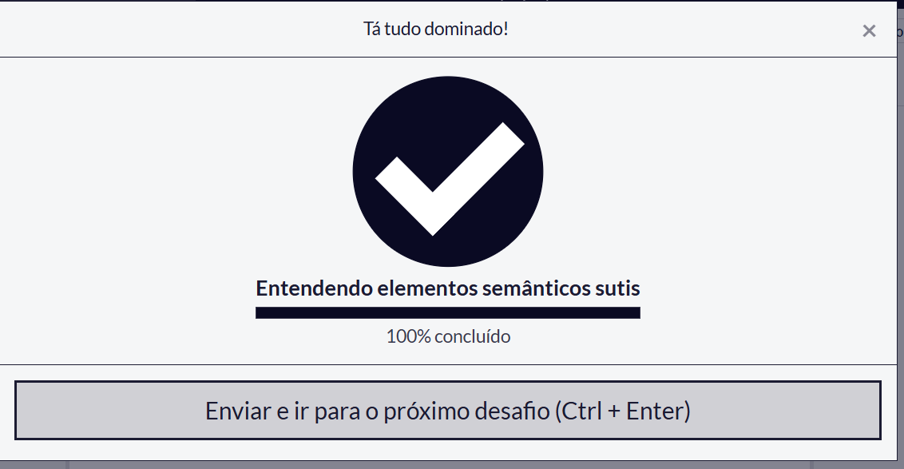
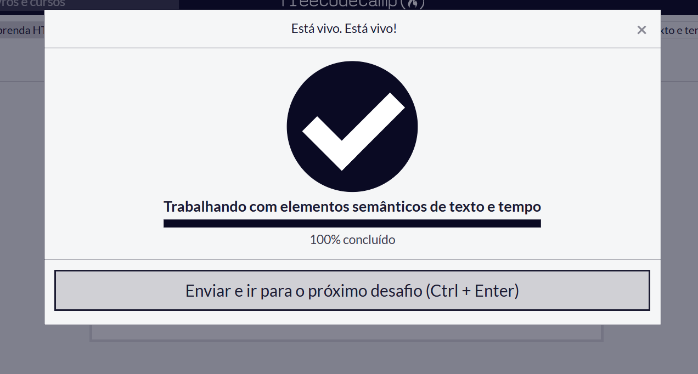
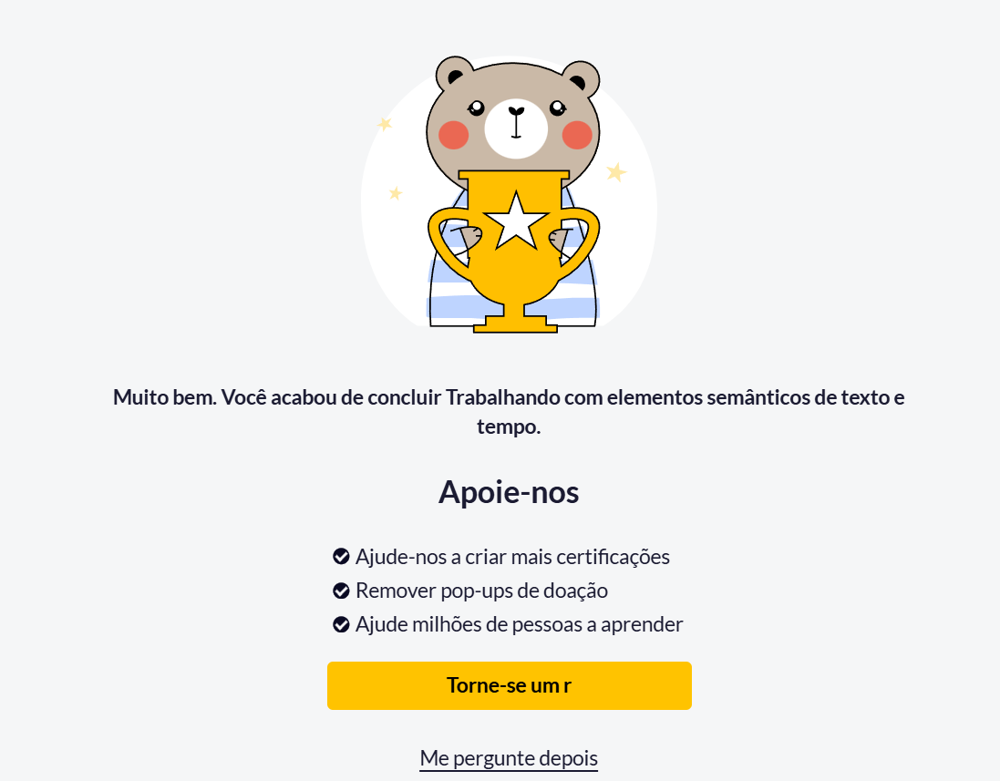
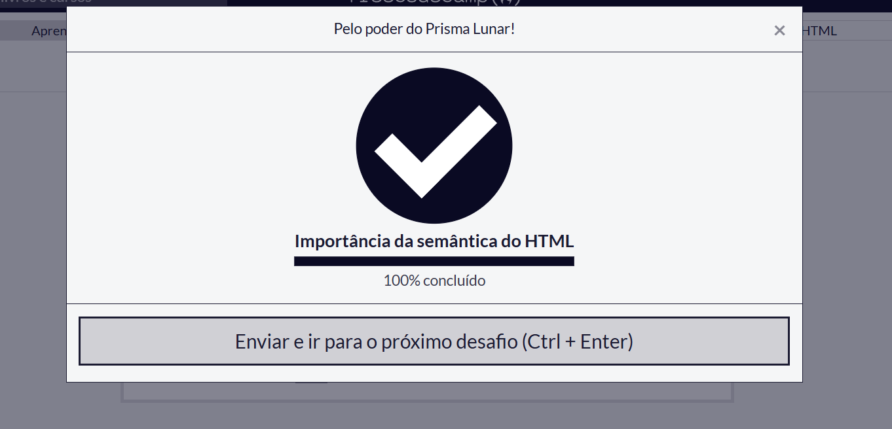

# Resolução de Desafios Práticos

* **Estudante:** Carlos Henrique Paz
* **Plataforma Utilizada:** freeCodeCamp
* **Tecnologia Praticada:** HTML
* **Disciplina:** [Design Profissional]

---

## Tabela de Exercícios e Comprovações

|  Nº | Desafios-programacao / Lição | Breve Explicação                                                                                        | Status na Plataforma |         Imagem Comprobatória        |
| :-: | :---------------------- | :------------------------------------------------------------------------------------------------------ | :------------------: | :---------------------------------: |
| Nº | Desafio / Lição | Breve Explicação | Status na Plataforma | Imagem Comprobatória |
| :---: | :--- | :--- | :---: | :---: |
| 01 | HTML Semântico | Prática de elementos semânticos para estruturar e organizar corretamente o conteúdo de uma página HTML. | Aprovado |  |
| 02 | Textos | Utilização de elementos HTML para criar e organizar textos dentro de uma página. | Aprovado |  |
| 03 | Tempo | Prática de elementos HTML relacionados à representação de informações de tempo. | Aprovado |  |
| 04 | Estrutura Geral | Organização geral da estrutura de marcação da página web. | Aprovado |  |

---

## Resumo dos Conceitos Praticados

Durante a realização dos desafios, foram praticados conceitos fundamentais de HTML, incluindo HTML semântico, estruturação e organização de textos e elementos relacionados à representação de informações de tempo.

Os exercícios ajudaram a compreender melhor como os elementos HTML podem ser utilizados para estruturar uma página de forma organizada e significativa. Também foi possível praticar a utilização correta das tags e compreender a importância da semântica na construção de páginas web.

---

## Ferramentas Utilizadas
* HTML
* Markdown
* Git
* GitHub
* Visual Studio Code
